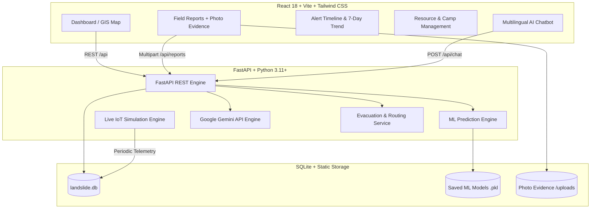

# 🛡️ NIRAKSHA AI — Landslide Early Warning & Disaster Response System

> **Smart India Hackathon (SIH) 2026 | Ministry of Development of North Eastern Region (MDoNER)**  
> Real-time IoT/GIS Telemetry, Machine Learning Hazard Forecasting, Google Gemini-Powered Multilingual AI Decision Support & Tactical Evacuation Routing across the 8 North-Eastern States of India.

---

## 📌 Overview

**NIRAKSHA** is an end-to-end intelligent disaster management platform tailored for the unique geo-topography and monsoon precipitation patterns of North-East India (**Assam, Meghalaya, Arunachal Pradesh, Sikkim, Manipur, Mizoram, Nagaland, and Tripura**).

It combines:
1. **IoT & Meteorological Telemetry**: Continuous monitoring of precipitation gauges, soil moisture, and slope gradient across 20 regional stations (with simulated/proxy demo inputs for GIS terrain parameters like TWI, river distance, and annual precipitation where real-time raster layers are unavailable in prototype mode).
2. **Machine Learning Risk Prediction**: Real-time composite hazard classification using Gradient Boosting, Random Forest, and XGBoost models trained on multi-factor terrain features.
3. **Google Gemini AI Decision Support**: Context-aware multilingual chatbot (**English, Hindi, Bengali, Assamese**) backed by Google Gemini API with real-time station metrics and emergency protocol recommendations.
4. **Automated Evacuation Routing**: Primary and alternative corridor clearance analysis, transit ETA calculations, and nearest relief camp allocation.
5. **Citizen Hazard Reporting**: Ground field evidence archival for human and authority inspection and emergency validation (photos treated purely as field evidence without claimed computer vision ML).
6. **Rule-Based Priority Response**: Multi-criteria decision-support ranking matching active alerts with available NDRF rescue teams and relief camps based on risk score, demographic vulnerability, road blockages, and elapsed time.

---

## 🏛️ System Architecture



---

## ✨ Key Features & Modules

### 1. GIS Dashboard & Live Telemetry
- **Interactive Geospatial Map**: Satellite, terrain, and street GIS layers with real-time risk heatmaps and village pins.
- **Top Priority Alert Cards**: Live station breakdown with composite score (0–100) and immediate action advisories.
- **State-wise Vulnerability Index**: Regional comparative risk metrics across all 8 NER states with high-contrast, crystal-clear custom tooltip popovers.
- **Precipitation & Risk Trend Projections**: 48-hour continuous trend telemetry with alert thresholds.

### 2. Google Gemini Multilingual AI Decision Assistant
- **Powered by Google Gemini**: Uses `gemini-3.6-flash` / `gemini-flash-latest` with live telemetry injection.
- **Bilingual & Regional Telemetry**: Fully conversational in **English**, **Hindi (हिन्दी)**, **Bengali (বাংলা)**, and **Assamese (অসমীয়া)**.
- **Dynamic Telemetry Fallback**: If network or quota limits occur, smoothly falls back to an internal live telemetry engine so disaster managers never face blank screens.
- **Quick Query Chips**: Instant access to regional status, hazard reporting guidelines, and evacuation protocols.

### 3. Field Reports & Ground Visual Evidence
- **Ground Evidence Archival**: Citizens and field personnel upload ground hazard photos preserved purely as field evidence for human and district authority verification.
- **Human/Authority Inspection**: Field evidence feeds directly to emergency managers for manual review and dispatch confirmation without fake automated AI classification.
- **Color-Coded Badging**:
  - 🟢 **Levels 1–2**: Minor / Low Risk
  - 🟡 **Level 3**: Medium Severity
  - 🔴 **Levels 4–5**: Severe / Automatic Authority Alert Trigger

### 4. Evacuation Protocols & Route Clearance
- **Station-Specific Routing**: Dual-route guidance (Primary & Alternate) with distance, transit ETA, and obstruction status.
- **Relief Camp Logistics**: Distance to nearest civil hospital camp, total capacity, and vehicle dispatch requirements.

### 5. Alert Timeline & Incident History
- **Historical Analysis**: 7-day retrospective hazard records with date, state, and severity filters.
- **Deduplication Safeguard**: Prevents alert spamming by checking for duplicates within 1 hour for identical risk thresholds.
- **Operational Metrics**: Average emergency response minutes, critical incident counts, and per-state aggregations.

### 6. NDRF Resource Allocation
- **Automated Team Assignment**: Recommends the nearest available NDRF team and relief camp for active high/critical warnings with operational reasoning.
- **Deployment Logs**: Historical tracking of team mobilizations.

---

## 🛠️ Technology Stack

| Layer | Technologies |
|---|---|
| **Frontend** | React 18, Vite, Tailwind CSS, Leaflet, React-Leaflet, Recharts, Lucide Icons, Date-fns, React Hot Toast |
| **Backend** | Python, FastAPI, Uvicorn, SQLAlchemy, Pydantic v2, HTTPX, Python-dotenv |
| **AI / LLM** | Google Gemini API (`gemini-3.6-flash`, `gemini-flash-latest`) |
| **Machine Learning** | Scikit-Learn (Gradient Boosting Classifier, Random Forest), XGBoost, Joblib |
| **Database & Storage** | SQLite (WAL mode enabled), Local multipart file storage |
| **Localization** | Custom React Context translation engine supporting EN, HI, BN, AS |

---

## ⚙️ Environment Variables

Create or verify `.env` in the project root:

```env
GEMINI_API_KEY=your_google_gemini_api_key_here
VITE_GEMINI_API_KEY=your_google_gemini_api_key_here
```

---

## 🚀 Quick Start Guide

### Prerequisites
- **Python 3.10+** (Tested on Python 3.11 & 3.14)
- **Node.js 18+** & **npm**

---

### Step 1: Backend Setup

1. Open a terminal in the project root:
   ```bash
   cd "d:/SIH NIRAKSHA"
   ```

2. (Optional) Create and activate a virtual environment:
   ```bash
   python -m venv .venv
   # Windows PowerShell:
   .venv\Scripts\Activate.ps1
   # Linux/macOS:
   source .venv/bin/activate
   ```

3. Install required Python packages:
   ```bash
   pip install -r requirements.txt
   ```

4. Start the FastAPI backend server:
   ```bash
   python -m uvicorn main:app --host 127.0.0.1 --port 8000 --reload
   ```
   - **Backend URL**: http://127.0.0.1:8000
   - **Swagger API Docs**: http://127.0.0.1:8000/docs

---

### Step 2: Frontend Setup

1. Open a new terminal and navigate to the frontend directory:
   ```bash
   cd "d:/SIH NIRAKSHA/frontend"
   ```

2. Install dependencies:
   ```bash
   npm install
   ```

3. Start the Vite development server:
   ```bash
   npm run dev -- --host 127.0.0.1 --port 5173
   ```
   - **Frontend App**: http://127.0.0.1:5173

---

### Step 3: Running Tests

To run the automated backend test suites:
```bash
python -m pytest tests/
```

---

## 📡 API Endpoints Overview

| Method | Endpoint | Description |
|---|---|---|
| `GET` | `/api/stations` | List all 20 NER automated monitoring stations |
| `GET` | `/api/stations/{id}` | Detailed telemetry and sensor history for a station |
| `GET` | `/api/stations/{id}/evacuation` | Primary/alternate routes and relief camp logistics |
| `GET` | `/api/alerts` | List all current and recent landslide alerts |
| `GET` | `/api/alerts/active` | Filter active warnings requiring immediate intervention |
| `GET` | `/api/alerts/statistics` | Aggregated metrics (counts, avg response minutes, state breakdown) |
| `GET` | `/api/alerts/history` | Filterable alert history by date, state, and severity |
| `POST` | `/api/reports/upload-photo` | Multipart photo upload with computer vision hazard detection |
| `POST` | `/api/reports` | Submit citizen/field report (triggers DDMA notification on high risk) |
| `GET` | `/api/reports` | Retrieve recent field reports with AI analysis metadata |
| `GET` | `/api/resources` | NDRF team availability and relief camp tracking |
| `GET` | `/api/resources/assignment` | Tactical rescue team and relief camp assignment recommendation |
| `POST` | `/api/resources/assign` | Deploy an assigned NDRF team |
| `POST` | `/api/chat` | Google Gemini AI assistant (English, Hindi, Bengali, Assamese) |

---

## 👥 Contributors
Developed for the **Smart India Hackathon 2026** by Team NIRAKSHA.  
*In coordination with the Ministry of Development of North Eastern Region (MDoNER), Government of India.* 🇮🇳
